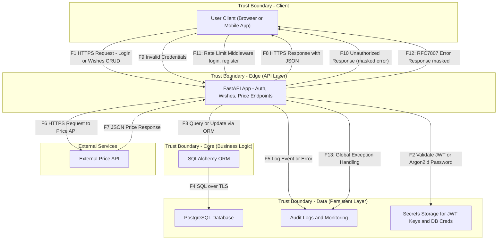

# 🧩 P04 — Data Flow Diagram (DFD)

## 1. Контекст

**Сервис:** Wishes App (FastAPI + PostgreSQL + JWT + роли + внешний Price API)
**Цель:** показать, как данные проходят через систему и где проходят границы доверия.

### Уровни доверия
- **External** — пользователь, клиент (браузер, мобильное приложение).
- **Edge** — слой API (FastAPI), зона аутентификации и бизнес-логики.
- **Core** — внутренние данные (PostgreSQL, секреты, аудит).
- **External Service** — внешний поставщик данных (Price API).

---

## 2. Основная DFD (Mermaid)

# Data Flow Diagram (DFD) — FastAPI Wish Service

